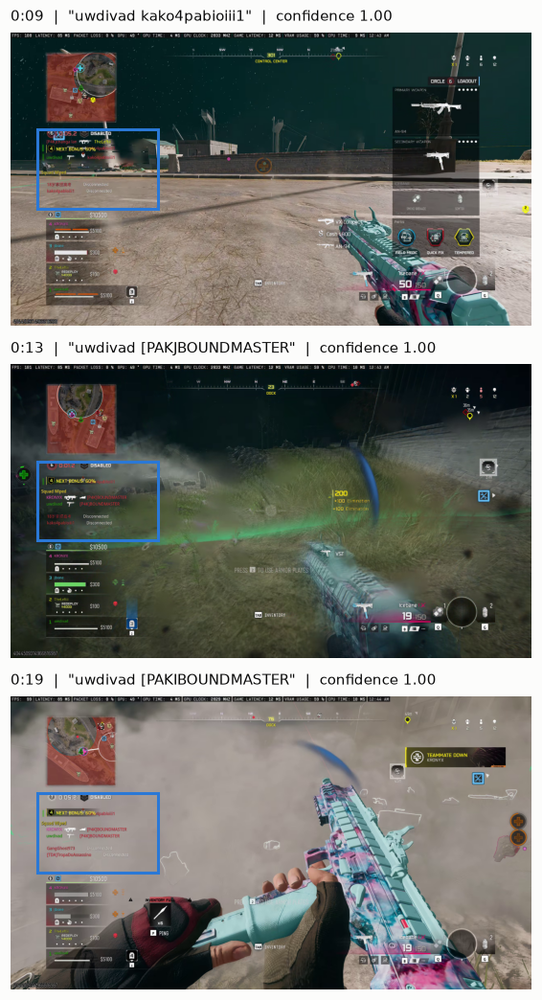

# vidgrep

Scan a video for text or a visual pattern, then extract clips around each match.

```
vidgrep match.mp4 --text "GOAL"
vidgrep gameplay.mp4 --template logo.png
```

)

## How it works

1. Samples every Nth frame of the video (default: every 3rd) — or one frame every N seconds with `--interval`. Sampling and `--region` cropping run inside FFmpeg, so skipped frames are nearly free. On NVIDIA GPUs, decoding runs on the NVDEC hardware engine with the region cropped before frames leave the GPU, falling back to software decode automatically
2. Runs OCR or template matching on each sampled frame, batched on the GPU while a prefetch thread keeps FFmpeg decoding in parallel
3. Merges nearby hit windows into intervals
4. Extracts a padded clip for each interval via FFmpeg

See [docs/making-ocr-scans-6x-faster.md](docs/making-ocr-scans-6x-faster.md)
for how the scan pipeline was profiled and optimised (~6× on the benchmark
video).

## Requirements

- Python 3.9+
- FFmpeg on `PATH`
  - **Linux:** `sudo apt install ffmpeg`
  - **Windows:** download from [gyan.dev](https://www.gyan.dev/ffmpeg/builds/) (`ffmpeg-release-essentials.zip`), add the `bin/` folder to your system PATH
- CUDA-capable GPU (optional but strongly recommended for OCR)

## Installation

Install CUDA-enabled PyTorch **first** — EasyOCR picks up the CUDA build at import time:

```bash
pip install torch torchvision --index-url https://download.pytorch.org/whl/cu128
```

Then install the rest:

```bash
pip install -e .
```

To include the unit-test runner:

```bash
pip install -e ".[test]"
```

To include the terminal dashboard:

```bash
pip install -e ".[tui]"
```

To run on CPU only, skip the PyTorch step (a CPU build will be pulled in automatically) and pass `--no-gpu` at runtime.

## Usage

```
vidgrep <input> (--text PATTERN | --template IMAGE) [options]
```

The editable install exposes these commands:

| Command | Description |
|---------|-------------|
| `vidgrep` | Scan videos and extract matching clips, or run `vidgrep scan` for JSONL metadata only |
| `vidgrep worker` | Process inventory CSV rows as a resumable OCR queue |
| `vidgrep-region` | Interactive helper for choosing a `--region X Y W H` crop |
| `vidgrep-tui` | Interactive scan dashboard with live progress, matches, logs, and clip extraction |

For development from the repo root, `python -m vidgrep ...` and `python -m vidgrep.select_region ...` still work.

### Terminal dashboard

Install the TUI extra, then launch:

```bash
vidgrep-tui
vidgrep-tui match.mp4 --text "GOAL" --interval 2
```

The dashboard currently focuses on OCR text scans. It can scan one file or a
directory, show match and interval results, then extract all intervals or the
selected interval using the same FFmpeg extraction code as the CLI.

### Video inventory

Use `vidgrep inventory` to find video files without running OCR:

```bash
# Scan all local drives on Windows, or / on Linux/macOS.
# Without --output, the output stem defaults to yyyy-mm-dd.
vidgrep inventory

# Scan one directory
vidgrep inventory "D:\Media" --output media_videos

# Filter by filename, case-insensitive
vidgrep inventory --name "match" --output match_videos

# Regex against filename or directory path
vidgrep inventory --regex "goal|highlight" --output goal_or_highlight

# Regex only against directory path
vidgrep inventory --regex "2026\\(clips|archive)" --regex-scope directory
```

The inventory command writes paired files: `<stem>.csv` with
`filename,path,video_format,size,date,processed`, and `<stem>.json` with the same records
plus roots scanned, filters, extensions, totals, and skipped access errors.
The `processed` column defaults to `false` so the CSV can be used as a queue.
If the CSV already exists, inventory merges by `path`, appends new rows, and
preserves existing worker status columns.

### OCR worker

Use `vidgrep worker` to process an inventory CSV row by row with OCR:

```bash
vidgrep worker videos.csv --text "uwdivad" --region 132 476 592 388 --interval 2 --batch-size 16 --stats
```

The worker runs the equivalent of `vidgrep scan` for each row's `path`, streams
output line by line to a partial file, atomically publishes per-video JSONL
results under `<csv_stem>_ocr/` after success, and updates the CSV after each
row. Successful rows get `processed=true`; failed or missing files remain
`processed=false`, so rerunning the same command retries the first unfinished
row and continues through the rest.

### Result grouping agent

Use `vidgrep agent` to canonicalize OCR line variants through the OpenAI
Responses API and merge them into labeled time intervals:

```bash
vidgrep agent videos.csv --search-term "uwdivad"
vidgrep agent worker_results --search-term "uwdivad" --watch
```

CSV input consumes only successful worker rows. Canonicalizations are cached in
`<stem>.agent.state.json`; `--force` refreshes that cache once at startup, even
when combined with `--watch`.

### Searching scan results

Use `vidgrep.ocr_db` to combine a directory of scan output (`.jsonl` + `.json`
pairs, e.g. a worker's `<csv_stem>_ocr/` folder) into a searchable SQLite
database with full-text search:

```bash
python -m vidgrep.ocr_db ingest data/lasts4_ocr --db data/lasts4_ocr.db
python -m vidgrep.ocr_db search "contract started" --db data/lasts4_ocr.db
python -m vidgrep.ocr_db search "complete*" --db data/lasts4_ocr.db --gap 10 --min-conf 0.7
```

Ingest is incremental and safe to re-run while scans are still writing:
unchanged files are skipped, malformed lines are logged and ignored, and each
file commits in its own transaction. Search takes FTS5 queries (quoted
phrases, `*` prefixes, `AND`/`OR`/`NEAR`) and groups consecutive hits within
`--gap` seconds into one occurrence window per video, printing the time range,
hit count, and best-confidence sample text.

### Detection modes

| Flag | Description |
|------|-------------|
| `--text PATTERN` | Match frames whose visible text contains this regex (case-insensitive) |
| `--template IMAGE` | Match frames containing this image via normalised cross-correlation |

### Options

| Flag | Default | Description |
|------|---------|-------------|
| `--output PATH` | `<stem>_clip[_N]<ext>` | Output file path |
| `--padding SEC` | `5.0` | Seconds to include before and after each match |
| `--skip-frames N` | `3` | Sample every Nth frame (higher = faster scan) |
| `--interval SEC` | — | Sample one frame every SEC seconds (frame-rate independent; overrides `--skip-frames`). Much faster on long videos |
| `--batch-size N` | `8` | Frames per OCR batch (higher = better GPU utilisation, more VRAM) |
| `--stats` | — | Print decode/detect throughput (fps, ×-realtime) after each scan |
| `--profile` | — | Record per-video timing metrics (decode wait, OCR, writes) — `scan`/`worker` only |
| `--metrics-output PATH` | `<stem>.profile.csv` | Where `--profile` appends its CSV/JSONL rows |
| `--threshold 0-1` | `0.5` | Min OCR confidence or template similarity to count as a match |
| `--region X Y W H` | — | Crop each frame to this rectangle before scanning |
| `--merge-gap SEC` | `2.0` | Merge match windows separated by less than this |
| `--min-duration SEC` | `0.0` | Discard matched intervals shorter than this |
| `--lang CODES` | `en` | Comma-separated EasyOCR language codes (e.g. `en,fr`) |
| `--no-gpu` | — | Disable CUDA, run on CPU |
| `--reencode` | — | Re-encode with NVENC (frame-accurate cuts) |
| `--lossless` | — | Re-encode with libx264 CRF 0 (frame-accurate, larger files) |
| `--concat` | — | Concatenate all clips into a single output file |

### Output

By default clips are stream-copied (fast, but cuts snap to the nearest keyframe, ~2s inaccuracy). Use `--lossless` or `--reencode` for frame-accurate cuts. Because WebM cannot contain the H.264 used by these modes, re-encoded `.webm` inputs default to `.mkv` output unless an explicit compatible path is supplied.

## Examples

```bash
# Extract every moment "GOAL" appears, ±5 s
vidgrep match.mp4 --text "GOAL"

# Only scan the bottom third of the frame (faster OCR)
vidgrep stream.mp4 --text "LIVE" --region 0 720 1280 360

# Template matching with a higher similarity threshold
vidgrep gameplay.mp4 --template hud.png --threshold 0.85

# Merge all clips into one file, re-encoded for frame accuracy
vidgrep movie.mp4 --text "Chapter" --concat --lossless

# Fast scan of a long video on CPU only
vidgrep long.mp4 --text "error" --skip-frames 10 --merge-gap 5 --no-gpu

# Sample one frame every 2 s — frame-rate independent, big speedup on long videos
vidgrep long.mp4 --text "error" --interval 2
```

## Troubleshooting

### OCR is running on the CPU even though I have a GPU

**Symptom.** Scanning is slow and you see a warning like:

```
'pin_memory' argument is set as true but no accelerator is found, then device pinned memory won't be used.
```

This means PyTorch can't see your GPU (`torch.cuda.is_available()` is `False`), so EasyOCR silently falls back to the CPU. The tool also prints its own warning at model load when this happens:

```
WARNING: GPU requested but CUDA is unavailable — running OCR on CPU (much slower). …
```

**Confirm it.** With your virtualenv activated:

```bash
python -c "import torch; print(torch.__version__); print('cuda avail:', torch.cuda.is_available()); print('cuda build:', torch.version.cuda)"
```

A version ending in `+cpu` and `cuda avail: False` means the **CPU-only** PyTorch wheel got installed.

**Fix.** Reinstall the CUDA build (the **cu128** wheel — required for RTX 50-series / Blackwell GPUs; older `cu121`/`cu118` wheels don't include the `sm_120` architecture and won't drive a 5090):

```bash
pip uninstall -y torch torchvision
pip install torch torchvision --index-url https://download.pytorch.org/whl/cu128
```

Re-run the confirm command — you want `cuda avail: True` and `cuda build: 12.8`. Order matters: install CUDA-enabled PyTorch **before** EasyOCR, since EasyOCR binds to whatever torch build is present at import time.

### Checking GPU utilisation during a scan

Run a scan with `--stats` to get an app-level throughput number (decode fps, detect fps, ×-realtime). To watch the GPU live:

- `nvidia-smi dmon -s u` — watch the `dec` column (non-zero = hardware decode active) and `sm` (compute load).
- [`nvitop`](https://github.com/XuehaiPan/nvitop) (`pip install nvitop`) — interactive per-process GPU/VRAM graphs.
- **Windows Task Manager** → Performance → GPU: switch a graph to **CUDA** and watch the **Video Decode** pane.

If GPU compute stays low while a CPU core is pegged, the GPU is starved — raise `--batch-size`, add `--region` to shrink the OCR area, or sample fewer frames with `--skip-frames` / `--interval`.
